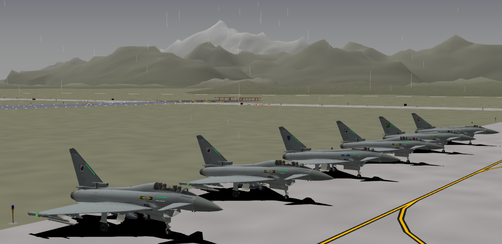
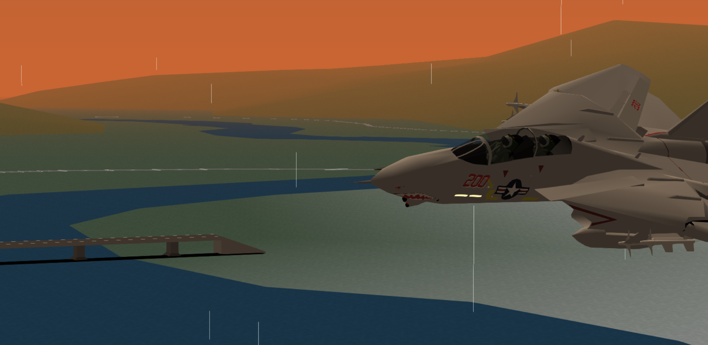

<p align="center">
  
</p>

<h1 align="center">❄️ CirnoYSF</h1>
<p align="center">
  <strong>The ice-cold blazing-fast modern fork of YSFlight ✈️</strong>
</p>

<p align="center">
  <a href="https://opensource.org/licenses/BSD-3-Clause"></a>
  
</p>

---

## 🌟 About

**CirnoYSF** is a modern, fast, and faithful fork of the legendary open-source flight simulator **YSFlight**, originally developed by Soji Yamakawa.

🧊 **CirnoYSF** brings frosty improvements and cutting-edge features, all while preserving the low-spec friendly charm of the original.

---

## 🚀 Features

✅ **Higher Refresh Rate Support** *(Linux only)*  
🌧️ **Weather Effects** – Rain, Fog, and more  
🌅 **Improved Lighting** – Sunset & time-based ambience  
📦 **Auto Add-on Installer** – One-click mod support  
🛩️ **Optimized Performance** – Object Culling and graphical refinements  
📋 **Cross-platform Ready** – Linux first, Windows support in-progress  
🔧 **Actively Maintained** – Open to issues, discussions, and PRs!

---

## 🖼️ Screenshots

<!-- Replace with actual screenshots -->
<p align="center">
  
  
</p>

---

## 🛠️ Build Instructions

```bash
# Clone the repo
git clone https://github.com/YOUR_USERNAME/CirnoYSF.git
cd CirnoYSF

# For Linux users
./build.sh

# For Windows (MSVC)
# please check the ci/cd command
# Todo update with actual commands
```

> 💡 Want MinGW support on Windows? Contributions welcome!


---

## 👨‍💻 Contributing

Pull requests are welcome! Open an issue to discuss features or improvements.  

---

## 📜 License

Licensed under the **BSD 3-Clause License** – see [LICENSE](LICENSE) for details.

---

## 💬 Acknowledgments

- ✈️ [YSFlight Official](http://ysflight.in.coocan.jp/)
- 👨‍🔧 Soji Yamakawa – Original developer
- ❄️ Cirno – ⑨ inspiration

---

<p align="center">
  <strong>Built with passion, ice, and code.</strong>
</p>

